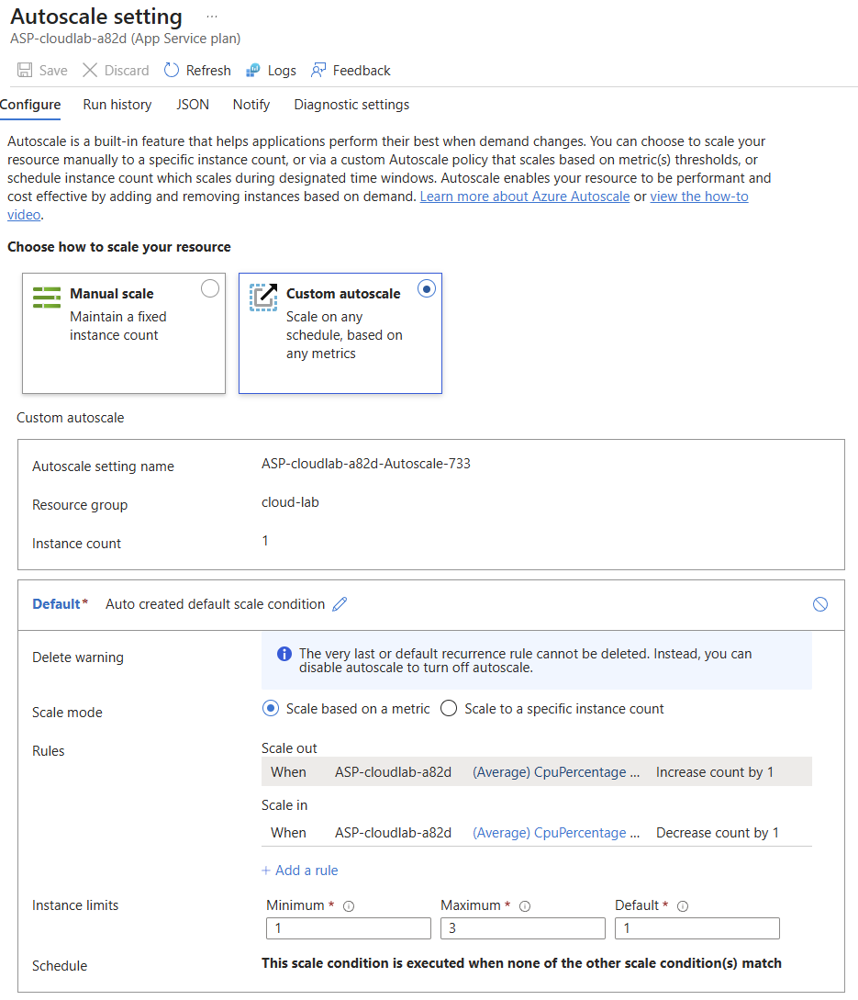
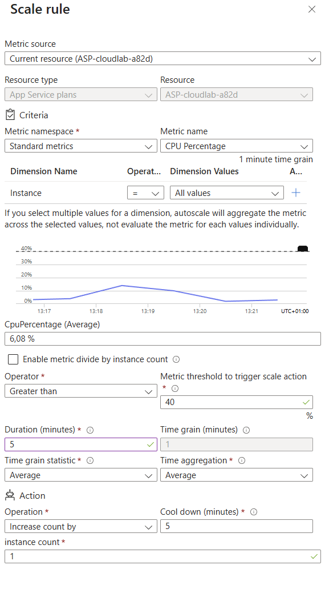
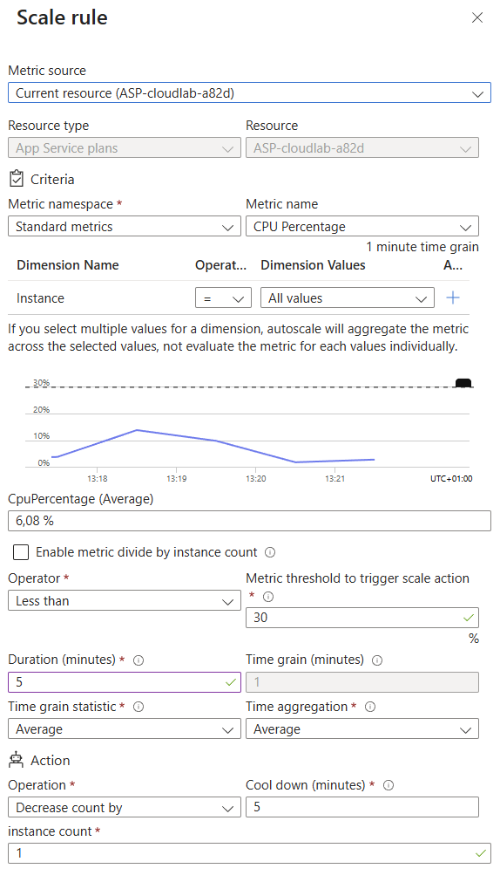

# Autoscale Configuration Documentation

## 1. PaaS Environment
- **Provider:** Microsoft Azure
- **Service:** Azure App Service (Linux)
- **Pricing Plan:** Premium V3 P0V3 (Supports custom auto-scaling)
- **Region:** Italy North

## 2. Scaling Rules (Custom Autoscale)
The application server is configured for dynamic, load-based scaling (Scale-out / Scale-in) based on CPU utilization. The instance count ranges between **1 and 3**.

**Scale-out Rule:**
- **Metric:** CPU Percentage (Average)
- **Condition:** Greater than 40%
- **Duration:** 5 minutes
- **Action:** Increase count by 1

**Scale-in Rule:**
- **Metric:** CPU Percentage (Average)
- **Condition:** Less than 30%
- **Duration:** 5 minutes
- **Action:** Decrease count by 1

## 3. Configuration & Evidence
The following screenshot shows the custom autoscale profile configured in the Azure Portal:

Azure Activity Log / Metrics recording the Scale-out event during the load test:

Log recording the Scale-in event after the load ceased:

