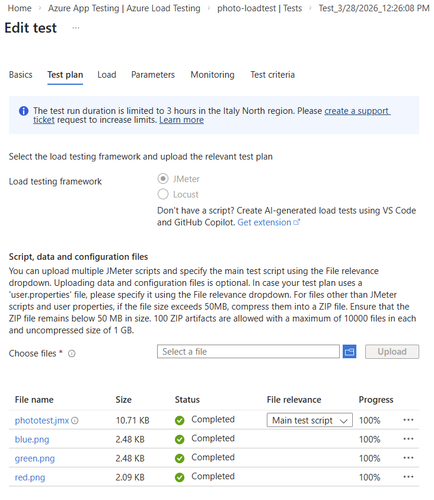
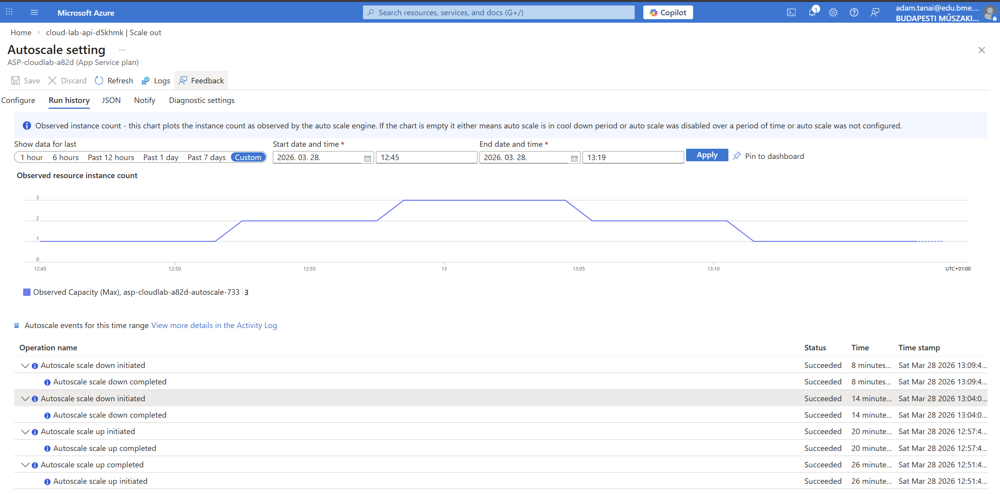
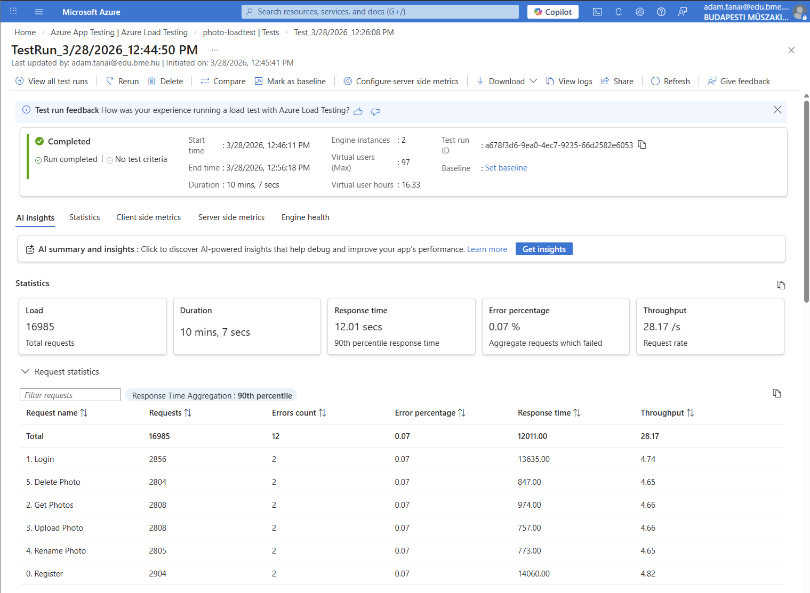
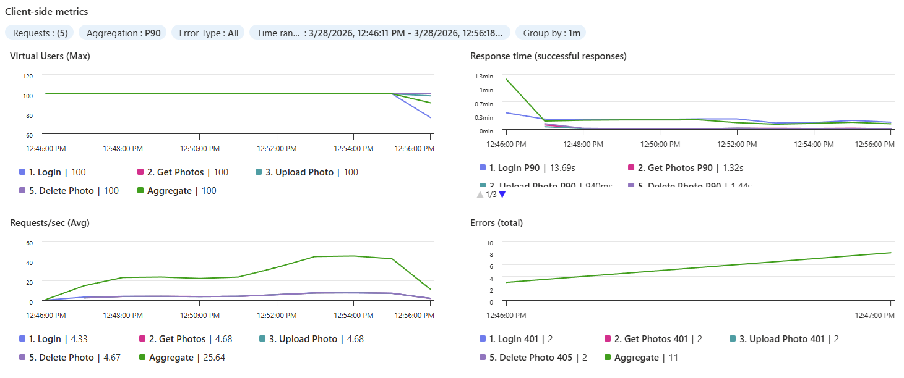
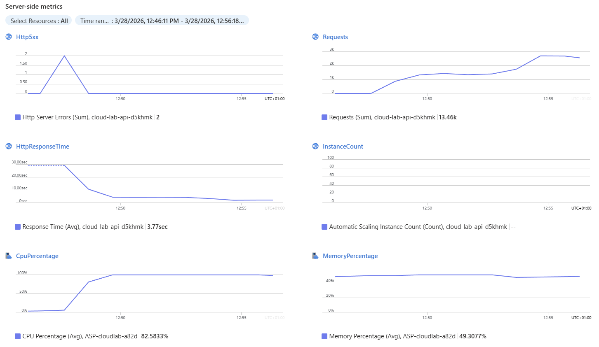
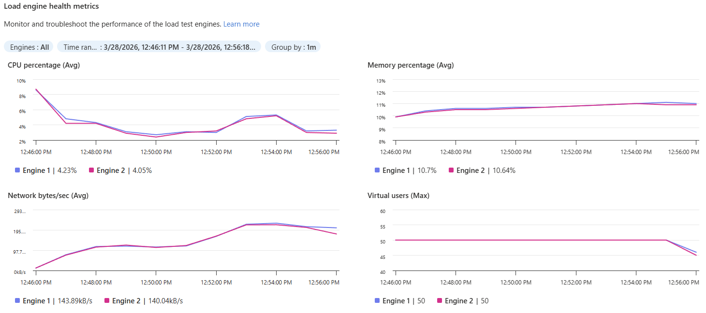

# Load Test Report

## 1. Test Environment & Tools
- **Tested Platform:** Azure App Service (Linux, .NET 10 API)
- **Database:** Azure SQL Database (Serverless) + Azure Blob Storage
- **Load Testing Tool:** Azure Load Testing (Apache JMeter engine)
- **Test Scenario:** Dynamic user registration (unique emails via Groovy script), login (JWT extraction), fetching photos, random photo upload (from 3 files), renaming photo, and deleting photo.

## 2. Test Configuration
- **Concurrent Users (Threads):** 50
- **Ramp-up Period:** 10 seconds
- **Duration:** 10 minutes (600 seconds)

Test run settings in Azure Load Testing:

## 3. Test Results

The generated traffic successfully triggered the configured scaling rules. Below are the captured metrics from the test execution:

**Scale-out Evidence (Instance Count):**

**Test Overview:**

**Client-side Metrics (Response times & Error rates):**

**Server-side Metrics (App Service CPU utilization):**

**Load Engine Metrics (Test runner health):**

